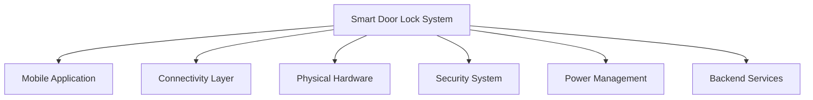
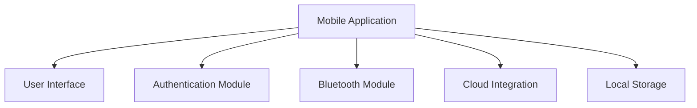
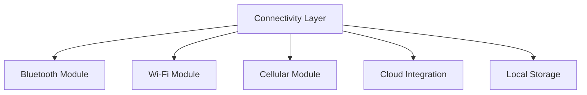
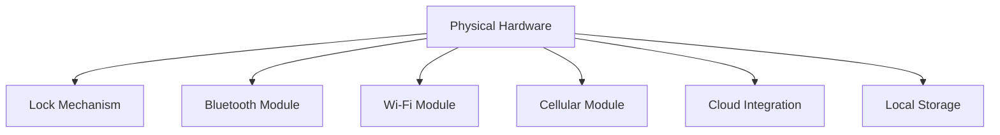
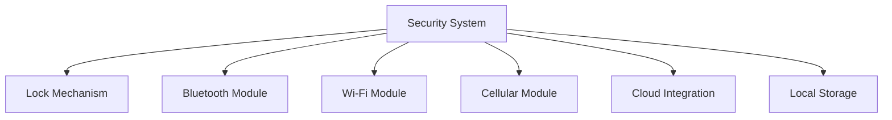
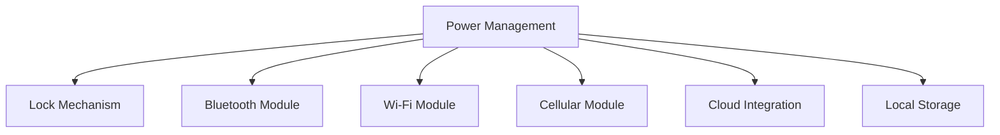
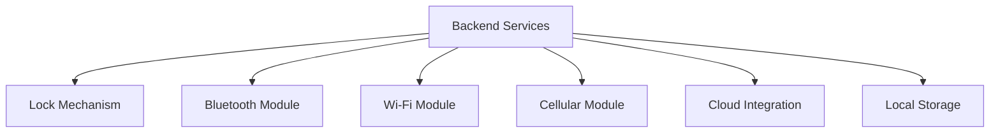

# Structured System Breakdown

## 🏗️ Smart Door Lock System Architecture

### Level 1: Main System Components

### Level 2: Mobile Application Breakdown

### Level 3: Connectivity Layer Breakdown

### Level 4: Physical Hardware Breakdown

### Level 5: Security System Breakdown

### Level 6: Power Management Breakdown

### Level 7: Backend Services Breakdown

